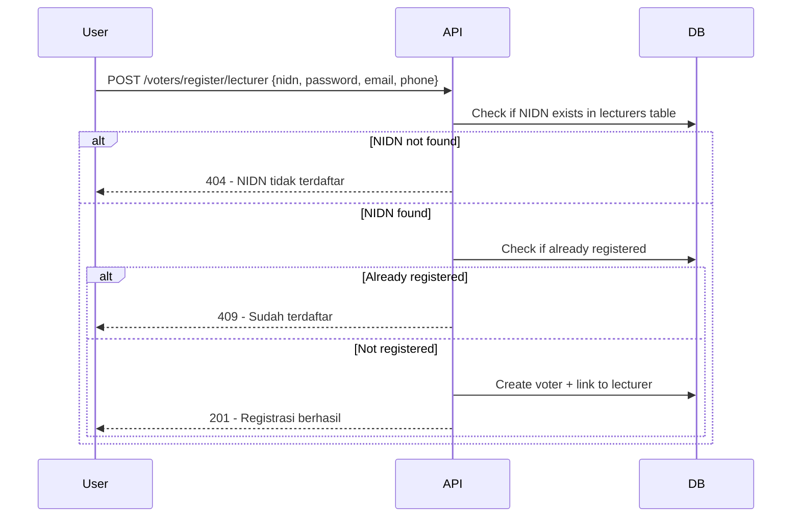
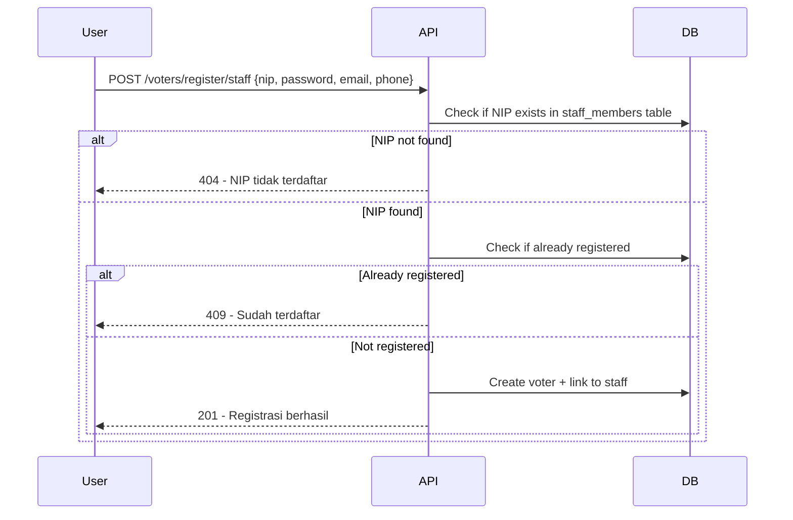

# API Contract - Voter Registration

**Date:** 2025-11-27  
**Version:** 2.0  
**Base URL:** `/api/v1`

---

## Table of Contents

1. [Overview](#overview)
2. [Registration Flow](#registration-flow)
3. [Endpoints](#endpoints)
4. [Data Models](#data-models)
5. [Validation Rules](#validation-rules)
6. [Error Codes](#error-codes)

---

## Overview

Voter Registration API allows new voters to register and create accounts:
- **STUDENT**: Register with NIM (Nomor Induk Mahasiswa)
- **LECTURER**: Register with NIDN (Nomor Induk Dosen Nasional)
- **STAFF**: Register with NIP (Nomor Induk Pegawai)

### Key Features

- ✅ Self-registration for all voter types
- ✅ Auto-generate email if not provided
- ✅ Master data integration (faculties, positions, units)
- ✅ Foreign key IDs automatically populated
- ✅ Support ONLINE and TPS voting modes
- ✅ Backward compatible (text fields maintained)

### What's New in v2.0

- **Master Tables Integration**: Faculty, program, unit, and position data from master tables
- **Automatic ID Lookup**: Foreign key IDs populated automatically during registration
- **Email Auto-generation**: Empty email becomes `{username}@pemira.ac.id`
- **Voting Mode Selection**: Choose between ONLINE or TPS during registration
- **Unified Endpoint**: Lecturer and Staff use same endpoint with `type` parameter

### Architecture

```
user_accounts (authentication)
    ├─> voter_id    → voters table
    ├─> lecturer_id → lecturers table (LECTURER only)
    └─> staff_id    → staff_members table (STAFF only)

voters table (all voters)
    ├─> faculty_name (text)
    └─> study_program_name (text)

lecturers table
    ├─> unit_id → lecturer_units (FK)
    └─> position_id → lecturer_positions (FK)

staff_members table
    ├─> unit_id → staff_units (FK)
    └─> position_id → staff_positions (FK)
```

---

## Registration Flow

### 1. Student Registration


### 2. Lecturer Registration



### 3. Staff Registration



---

## Endpoints

### 1. Register Student

**Endpoint:** `POST /auth/register/student`

**Description:** Register a new student account with voter profile.

**Request Body:**
```json
{
  "nim": "2024001002",
  "name": "Budi Santoso",
  "email": "",
  "faculty_name": "Fakultas Ekonomi",
  "study_program_name": "Akuntansi",
  "semester": "5",
  "password": "password123",
  "voting_mode": "ONLINE"
}
```

**Field Rules:**
- `nim`: Required, unique, will be used as username
- `name`: Required, full name
- `email`: Optional, if empty will auto-generate as `{nim}@pemira.ac.id`
- `faculty_name`: Required, must match one of available faculties
- `study_program_name`: Required, must match study program name
- `semester`: Required, current semester (1-14)
- `password`: Required, min 6 characters
- `voting_mode`: Optional, `"ONLINE"` or `"TPS"`, default `"ONLINE"`

**Response 201 - Success:**
```json
{
  "message": "Registrasi mahasiswa berhasil.",
  "user": {
    "id": 67,
    "username": "2024001002",
    "role": "STUDENT",
    "voter_id": 62,
    "profile": {
      "name": "Budi Santoso",
      "faculty_name": "Fakultas Ekonomi",
      "study_program_name": "Akuntansi",
      "semester": "5"
    }
  },
  "voting_mode": "ONLINE"
}
```

**Response 409 - Username Exists:**
```json
{
  "code": "USERNAME_EXISTS",
  "message": "Username sudah terdaftar."
}
```

**Response 400 - Validation Error:**
```json
{
  "code": "VALIDATION_ERROR",
  "message": "Data registrasi tidak lengkap atau tidak valid."
}
```

---

### 2. Register Lecturer / Staff

**Endpoint:** `POST /auth/register/lecturer-staff`

**Description:** Register a new lecturer or staff account with voter profile.

#### For Lecturer

**Request Body:**
```json
{
  "type": "LECTURER",
  "nidn": "0020129001",
  "name": "Prof. Dr. Hartono, M.Sc",
  "email": "",
  "faculty_name": "Fakultas Kesehatan",
  "department_name": "Keperawatan",
  "position": "Guru Besar",
  "password": "password123",
  "voting_mode": "ONLINE"
}
```

**Field Rules:**
- `type`: Required, must be `"LECTURER"`
- `nidn`: Required, unique, will be used as username
- `name`: Required, full name with title
- `email`: Optional, if empty will auto-generate as `{nidn}@pemira.ac.id`
- `faculty_name`: Required, must match one of lecturer units
- `department_name`: Required
- `position`: Required, must match one of lecturer positions
- `password`: Required, min 6 characters
- `voting_mode`: Optional, `"ONLINE"` or `"TPS"`, default `"ONLINE"`

**Response 201 - Success:**
```json
{
  "message": "Registrasi berhasil.",
  "user": {
    "id": 68,
    "username": "0020129001",
    "role": "LECTURER",
    "voter_id": 63,
    "lecturer_id": 13,
    "profile": {
      "name": "Prof. Dr. Hartono, M.Sc",
      "faculty_name": "Fakultas Kesehatan",
      "department_name": "Keperawatan",
      "position": "Guru Besar"
    }
  },
  "voting_mode": "ONLINE"
}
```

#### For Staff

**Request Body:**
```json
{
  "type": "STAFF",
  "nip": "199203151234568",
  "name": "Indah Permata Sari",
  "email": "",
  "unit_name": "Biro Administrasi Keuangan",
  "position": "Staf",
  "password": "password123",
  "voting_mode": "TPS"
}
```

**Field Rules:**
- `type`: Required, must be `"STAFF"`
- `nip`: Required, unique, will be used as username
- `name`: Required, full name
- `email`: Optional, if empty will auto-generate as `{nip}@pemira.ac.id`
- `unit_name`: Required, must match one of staff units
- `position`: Required, must match one of staff positions
- `password`: Required, min 6 characters
- `voting_mode`: Optional, `"ONLINE"` or `"TPS"`, default `"ONLINE"`

**Response 201 - Success:**
```json
{
  "message": "Registrasi berhasil.",
  "user": {
    "id": 69,
    "username": "199203151234568",
    "role": "STAFF",
    "voter_id": 64,
    "staff_id": 17,
    "profile": {
      "name": "Indah Permata Sari",
      "unit_name": "Biro Administrasi Keuangan",
      "position": "Staf"
    }
  },
  "voting_mode": "TPS"
}
```

**Response 409 - Username Exists:**
```json
{
  "code": "USERNAME_EXISTS",
  "message": "Username sudah terdaftar."
}
```

**Response 400 - Validation Error:**
```json
{
  "code": "VALIDATION_ERROR",
  "message": "Data registrasi tidak lengkap atau tidak valid."
}
```
```

---

### 3. Get Master Data - Faculties & Study Programs

**Endpoint:** `GET /meta/faculties-programs`

**Description:** Get all faculties with their study programs (legacy format for dropdowns).

**Response 200:**
```json
{
  "faculties": [
    {
      "faculty": "Fakultas Agama / Syariah",
      "programs": [
        "S1 Hukum Keluarga Islam"
      ]
    },
    {
      "faculty": "Fakultas Ekonomi",
      "programs": [
        "S1 Akuntansi",
        "S1 Manajemen"
      ]
    },
    {
      "faculty": "Fakultas Teknik",
      "programs": [
        "S1 Teknik Informatika",
        "S1 Teknik Industri",
        "S1 Teknik Mesin",
        "S1 Teknik Sipil"
      ]
    }
  ]
}
```

---

### 4. Get Master Data - Faculties

**Endpoint:** `GET /master/faculties`

**Description:** Get all faculties with IDs.

**Response 200:**
```json
{
  "data": [
    {
      "id": 1,
      "code": "FAS",
      "name": "Fakultas Agama / Syariah",
      "created_at": "2025-11-26T16:27:07.566503Z",
      "updated_at": "2025-11-26T16:27:07.566503Z"
    },
    {
      "id": 5,
      "code": "FT",
      "name": "Fakultas Teknik",
      "created_at": "2025-11-26T16:27:07.566503Z",
      "updated_at": "2025-11-26T16:27:07.566503Z"
    }
  ]
}
```

---

### 5. Get Master Data - Study Programs

**Endpoint:** `GET /master/study-programs?faculty_id={id}`

**Description:** Get study programs, optionally filtered by faculty.

**Query Parameters:**
- `faculty_id`: Optional, filter by faculty ID

**Response 200:**
```json
{
  "data": [
    {
      "id": 7,
      "faculty_id": 5,
      "code": "TI",
      "name": "Teknik Informatika",
      "level": "S1",
      "created_at": "2025-11-26T16:27:07.571853Z",
      "updated_at": "2025-11-26T16:27:07.571853Z"
    },
    {
      "id": 8,
      "faculty_id": 5,
      "code": "TIn",
      "name": "Teknik Industri",
      "level": "S1",
      "created_at": "2025-11-26T16:27:07.571853Z",
      "updated_at": "2025-11-26T16:27:07.571853Z"
    }
  ]
}
```

---

### 6. Get Master Data - Lecturer Units

**Endpoint:** `GET /master/lecturer-units`

**Description:** Get all lecturer units (faculties, research centers, etc).

**Response 200:**
```json
{
  "data": [
    {
      "id": 5,
      "code": "FT",
      "name": "Fakultas Teknik",
      "created_at": "2025-11-26T16:27:07.598562Z",
      "updated_at": "2025-11-26T16:27:07.598562Z"
    },
    {
      "id": 7,
      "code": "LPPM",
      "name": "Lembaga Penelitian dan Pengabdian Masyarakat",
      "created_at": "2025-11-26T16:27:07.598562Z",
      "updated_at": "2025-11-26T16:27:07.598562Z"
    }
  ]
}
```

---

### 7. Get Master Data - Lecturer Positions

**Endpoint:** `GET /master/lecturer-positions?category={category}`

**Description:** Get lecturer positions, optionally filtered by category.

**Query Parameters:**
- `category`: Optional, `FUNGSIONAL` or `STRUKTURAL`

**Response 200:**
```json
{
  "data": [
    {
      "id": 1,
      "category": "FUNGSIONAL",
      "code": "AA",
      "name": "Asisten Ahli",
      "created_at": "2025-11-26T16:27:07.601212Z",
      "updated_at": "2025-11-26T16:27:07.601212Z"
    },
    {
      "id": 2,
      "category": "FUNGSIONAL",
      "code": "L",
      "name": "Lektor",
      "created_at": "2025-11-26T16:27:07.601212Z",
      "updated_at": "2025-11-26T16:27:07.601212Z"
    }
  ]
}
```

---

### 8. Get Master Data - Staff Units

**Endpoint:** `GET /master/staff-units`

**Description:** Get all staff units (bureaus, UPT, etc).

**Response 200:**
```json
{
  "data": [
    {
      "id": 2,
      "code": "BAAK",
      "name": "Biro Administrasi Akademik dan Kemahasiswaan",
      "created_at": "2025-11-26T16:27:07.604253Z",
      "updated_at": "2025-11-26T16:27:07.604253Z"
    },
    {
      "id": 3,
      "code": "BAK",
      "name": "Biro Administrasi Keuangan",
      "created_at": "2025-11-26T16:27:07.604253Z",
      "updated_at": "2025-11-26T16:27:07.604253Z"
    }
  ]
}
```

---

### 9. Get Master Data - Staff Positions

**Endpoint:** `GET /master/staff-positions`

**Description:** Get all staff positions.

**Response 200:**
```json
{
  "data": [
    {
      "id": 1,
      "code": "KEPALA_BIRO",
      "name": "Kepala Biro",
      "created_at": "2025-11-26T16:27:07.605861Z",
      "updated_at": "2025-11-26T16:27:07.605861Z"
    },
    {
      "id": 6,
      "code": "STAF",
      "name": "Staf",
      "created_at": "2025-11-26T16:27:07.605861Z",
      "updated_at": "2025-11-26T16:27:07.605861Z"
    }
  ]
}
```

---

### 10. Login

**Endpoint:** `POST /auth/login`

**Description:** Login with username (NIM/NIDN/NIP) and password.

**Request Body:**
```json
{
  "username": "2024001002",
  "password": "password123"
}
```

**Response 200 - Success:**
```json
{
  "access_token": "eyJhbGciOiJIUzI1NiIsInR5cCI6IkpXVCJ9...",
  "refresh_token": "eyJhbGciOiJIUzI1NiIsInR5cCI6IkpXVCJ9...",
  "token_type": "Bearer",
  "expires_in": 86400,
  "user": {
    "id": 67,
    "username": "2024001002",
    "role": "STUDENT",
    "voter_id": 62,
    "profile": {
      "name": "Budi Santoso",
      "faculty_name": "Fakultas Ekonomi",
      "study_program_name": "Akuntansi",
      "semester": "5"
    }
  }
}
```

**Response 401 - Invalid Credentials:**
```json
{
  "code": "INVALID_CREDENTIALS",
  "message": "Username atau password salah."
}
```
```

**Response 404 - Not Found:**
```json
{
  "success": false,
  "error": {
    "code": "IDENTITY_NOT_FOUND",
    "message": "Identitas tidak ditemukan di sistem."
  }
}
```

---

## Data Models

### Student Registration Request

```typescript
interface StudentRegistrationRequest {
  nim: string;                    // Required, unique
  name: string;                   // Required
  email?: string;                 // Optional, auto-generate if empty
  faculty_name: string;           // Required
  study_program_name: string;     // Required
  semester: string;               // Required (1-14)
  password: string;               // Required, min 6 chars
  voting_mode?: "ONLINE" | "TPS"; // Optional, default "ONLINE"
}
```

### Lecturer Registration Request

```typescript
interface LecturerRegistrationRequest {
  type: "LECTURER";               // Required
  nidn: string;                   // Required, unique
  name: string;                   // Required
  email?: string;                 // Optional, auto-generate if empty
  faculty_name: string;           // Required
  department_name: string;        // Required
  position: string;               // Required
  password: string;               // Required, min 6 chars
  voting_mode?: "ONLINE" | "TPS"; // Optional, default "ONLINE"
}
```

### Staff Registration Request

```typescript
interface StaffRegistrationRequest {
  type: "STAFF";                  // Required
  nip: string;                    // Required, unique
  name: string;                   // Required
  email?: string;                 // Optional, auto-generate if empty
  unit_name: string;              // Required
  position: string;               // Required
  password: string;               // Required, min 6 chars
  voting_mode?: "ONLINE" | "TPS"; // Optional, default "ONLINE"
}
```

### Registration Response

```typescript
interface RegistrationResponse {
  message: string;
  user: {
    id: number;
    username: string;           // NIM/NIDN/NIP
    role: "STUDENT" | "LECTURER" | "STAFF";
    voter_id: number;
    lecturer_id?: number;       // For LECTURER
    staff_id?: number;          // For STAFF
    profile: {
      name: string;
      faculty_name?: string;    // STUDENT, LECTURER
      study_program_name?: string; // STUDENT only
      semester?: string;        // STUDENT only
      department_name?: string; // LECTURER only
      position?: string;        // LECTURER, STAFF
      unit_name?: string;       // STAFF only
    };
  };
  voting_mode: "ONLINE" | "TPS";
}
```

### Master Data Models

```typescript
interface Faculty {
  id: number;
  code: string;
  name: string;
  created_at: string;
  updated_at: string;
}

interface StudyProgram {
  id: number;
  faculty_id: number;
  code: string;
  name: string;
  level: string;              // S1, S2, S3, D3, D4
  created_at: string;
  updated_at: string;
}

interface LecturerUnit {
  id: number;
  code: string;
  name: string;
  created_at: string;
  updated_at: string;
}

interface LecturerPosition {
  id: number;
  category: "FUNGSIONAL" | "STRUKTURAL";
  code: string;
  name: string;
  created_at: string;
  updated_at: string;
}

interface StaffUnit {
  id: number;
  code: string;
  name: string;
  created_at: string;
  updated_at: string;
}

interface StaffPosition {
  id: number;
  code: string;
  name: string;
  created_at: string;
  updated_at: string;
}
```

---

## Validation Rules

### Identity Number Validation

**NIM (Student):**
- Required
- Must be unique
- Will be used as username
- Format depends on university rules

**NIDN (Lecturer):**
- Required
- Must be unique
- Will be used as username
- Format: typically 10 digits

**NIP (Staff):**
- Required
- Must be unique
- Will be used as username
- Format: typically 18 digits (Indonesian civil servant format)

### Password Validation

- **Minimum:** 6 characters
- No maximum limit
- Any characters allowed
- Case sensitive

### Name Validation

- Required
- Full name
- Can include titles for lecturers (e.g., "Prof. Dr. ..., M.Sc")

### Email Validation

- **Optional** - auto-generated if empty
- Auto-generated format: `{username}@pemira.ac.id`
- Custom email: Standard email format

**Examples:**
- ✅ Valid: `user@example.com`, `john.doe@mail.edu`
- ✅ Auto-generated: `2024001002@pemira.ac.id`
- ❌ Invalid: `invalid`, `@example.com`

### Faculty/Unit Name Validation

- Must match existing master data
- If matched, foreign key ID will be automatically populated
- If not matched, stored as text only

### Position Validation

- Must match existing master data (lecturer_positions or staff_positions)
- If matched, foreign key ID will be automatically populated
- If not matched, stored as text only

### Semester Validation (Student only)

- Required
- Valid range: "1" to "14"
- Stored as text

### Voting Mode Validation

- Optional
- Valid values: `"ONLINE"` or `"TPS"`
- Default: `"ONLINE"` if not specified

- Must be valid HTTPS URL
- Recommended: Image extensions (jpg, jpeg, png, webp)
- No file size validation (handled by storage service)

---

## Business Rules

### 1. Identity Table First

Identity data (students, lecturers, staff_members) **must be created by admin first** before registration:

```sql
-- Admin creates student data first
INSERT INTO students (nim, name, faculty_code, program_code, cohort_year)
VALUES ('2021001', 'Ahmad Zulfikar', 'FTI', 'IF', 2021);

-- Then student can register
POST /voters/register/student {nim: '2021001', ...}
```

### 2. One Identity Per Voter

Each voter can only have **one identity type**:
- Cannot be STUDENT and LECTURER simultaneously
- Foreign keys: student_id, lecturer_id, staff_id (only one filled)
- Database constraint enforces this rule

### 3. Duplicate Prevention

- One identity can only register once
- Check based on identity linkage (student_id, lecturer_id, staff_id)
- Not based on email or phone (those can be null)

### 4. Name Consistency

Voter's name is **copied from identity table**:
- For consistency and data integrity
- Changes to name should update identity table
- Voter table reflects current identity name

### 5. Optional Contact Info

Email and phone are optional during registration:
- Can be added/updated later via profile API
- Not required for basic registration
- Recommended for notifications

---

## Error Codes

| Code | HTTP Status | Description |
|------|-------------|-------------|
| `NIM_NOT_FOUND` | 404 | NIM not in students table |
| `NIDN_NOT_FOUND` | 404 | NIDN not in lecturers table |
| `NIP_NOT_FOUND` | 404 | NIP not in staff_members table |
| `IDENTITY_NOT_FOUND` | 404 | Identity not in any table |
| `ALREADY_REGISTERED` | 409 | Identity already registered |
| `VALIDATION_ERROR` | 400 | Invalid input data |
| `PASSWORD_TOO_SHORT` | 400 | Password less than 8 chars |
| `INVALID_EMAIL` | 400 | Invalid email format |
| `INVALID_PHONE` | 400 | Invalid phone format |
| `INVALID_VOTER_TYPE` | 400 | Invalid voter type |
| `INTERNAL_ERROR` | 500 | Server error |

---

## Usage Examples

### Register Student

```bash
curl -X POST 'http://localhost:8080/api/v1/voters/register/student' \
  -H "Content-Type: application/json" \
  -d '{
    "nim": "2021001",
    "password": "password123",
    "email": "student@example.com",
    "phone": "081234567890"
  }'
```

### Register Lecturer

```bash
curl -X POST 'http://localhost:8080/api/v1/voters/register/lecturer' \
  -H "Content-Type: application/json" \
  -d '{
    "nidn": "0123456789",
    "password": "password123",
    "email": "lecturer@example.com",
    "phone": "081234567890"
  }'
```

### Register Staff

```bash
curl -X POST 'http://localhost:8080/api/v1/voters/register/staff' \
  -H "Content-Type: application/json" \
  -d '{
    "nip": "198501012010121001",
    "password": "password123",
    "email": "staff@example.com",
    "phone": "081234567890"
  }'
```

### Check Availability

```bash
# Check student
curl 'http://localhost:8080/api/v1/voters/register/check/student/2021001'

# Check lecturer
curl 'http://localhost:8080/api/v1/voters/register/check/lecturer/0123456789'

# Check staff
curl 'http://localhost:8080/api/v1/voters/register/check/staff/198501012010121001'
```

---

## Frontend Integration

### Registration Form Example

```typescript
interface RegistrationFormProps {
  type: 'student' | 'lecturer' | 'staff';
}

const RegistrationForm: React.FC<RegistrationFormProps> = ({ type }) => {
  const [formData, setFormData] = useState({
    identifier: '', // nim, nidn, or nip
    password: '',
    email: '',
    phone: '',
    photo_url: ''
  });

  const getIdentifierLabel = () => {
    switch (type) {
      case 'student': return 'NIM';
      case 'lecturer': return 'NIDN';
      case 'staff': return 'NIP';
    }
  };

  const handleSubmit = async (e: React.FormEvent) => {
    e.preventDefault();
    
    const endpoint = `/api/v1/voters/register/${type}`;
    const fieldName = type === 'student' ? 'nim' : 
                      type === 'lecturer' ? 'nidn' : 'nip';
    
    const payload = {
      [fieldName]: formData.identifier,
      password: formData.password,
      email: formData.email || undefined,
      phone: formData.phone || undefined,
      photo_url: formData.photo_url || undefined
    };

    try {
      const response = await fetch(endpoint, {
        method: 'POST',
        headers: { 'Content-Type': 'application/json' },
        body: JSON.stringify(payload)
      });
      
      const result = await response.json();
      
      if (result.success) {
        alert('Registrasi berhasil! Silakan login.');
        // Redirect to login
      } else {
        alert(`Error: ${result.error.message}`);
      }
    } catch (error) {
      console.error('Registration failed:', error);
    }
  };

  return (
    <form onSubmit={handleSubmit}>
      <input
        type="text"
        placeholder={getIdentifierLabel()}
        value={formData.identifier}
        onChange={(e) => setFormData({...formData, identifier: e.target.value})}
        required
      />
      <input
        type="password"
        placeholder="Password (min 8 karakter)"
        value={formData.password}
        onChange={(e) => setFormData({...formData, password: e.target.value})}
        minLength={8}
        required
      />
      <input
        type="email"
        placeholder="Email (opsional)"
        value={formData.email}
        onChange={(e) => setFormData({...formData, email: e.target.value})}
      />
      <input
        type="tel"
        placeholder="Telepon (opsional)"
        value={formData.phone}
        onChange={(e) => setFormData({...formData, phone: e.target.value})}
        pattern="^(08\d{8,11}|\+628\d{8,12})$"
      />
      <button type="submit">Daftar</button>
    </form>
  );
};
```

### Check Availability Before Registration

```typescript
const checkAvailability = async (type: string, identifier: string) => {
  try {
    const response = await fetch(
      `/api/v1/voters/register/check/${type}/${identifier}`
    );
    const result = await response.json();
    
    if (result.success && result.data.available) {
      console.log('Available:', result.data.name);
      return true;
    } else {
      console.log('Not available:', result.data.message);
      return false;
    }
  } catch (error) {
    console.error('Check failed:', error);
    return false;
  }
};
```

---

## Migration Notes

### From Old Schema to New Schema

If migrating from old schema where `voters` table had all fields:

1. **Migration 026** handles data migration automatically
2. Existing student voters are migrated to `students` table
3. Foreign keys are created and linked
4. Old columns kept for backward compatibility
5. Can be removed in future migration after full transition

### Data Integrity

- Identity tables are **source of truth**
- Voters table just links to identity
- Changes to academic data should update identity tables
- Voters table only stores voter-specific data (email, phone, photo)

---

## Important Notes

### 1. Identity Tables Must Exist

Before any registration:
- Admin must populate identity tables first
- Use admin API or database scripts
- No self-registration for identity data

### 2. Voter Type Cannot Change

Once registered:
- voter_type is immutable
- Cannot change STUDENT to LECTURER
- Must create new voter if type changes

### 3. Contact Information Optional

- Email and phone are optional
- Can register without contact info
- Can add later via profile API
- Recommended for notifications

### 4. Password Security

- Passwords are hashed (bcrypt)
- Never stored in plain text
- Minimum 8 characters enforced
- No complexity requirements (keep it simple)

### 5. Photo URLs

- Store URL, not file
- Use separate file upload service
- Recommend HTTPS only
- No file size/type validation in API

---

**Last Updated:** 2025-11-26  
**API Version:** 1.0  
**Maintained By:** Backend Team
